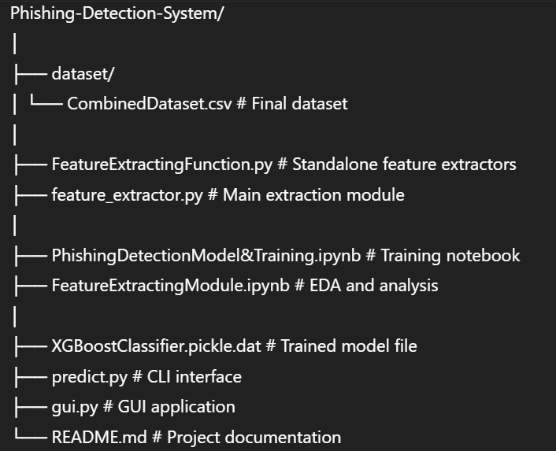
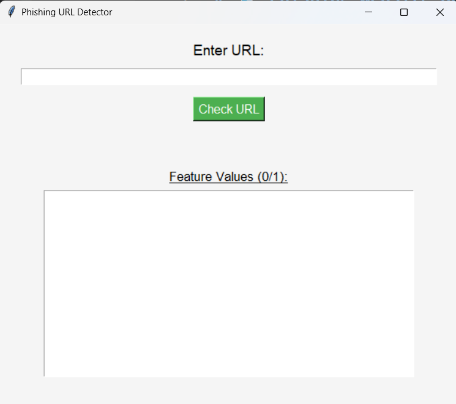

# 🛡️ Phishing Website Detection Using Machine Learning

This project is a complete end-to-end system designed to detect phishing websites using machine learning. It analyzes various features of a URL to determine if it is a legitimate link or a malicious phishing attempt.

---

## 📑 Table of Contents

- [Overview](#-overview)
- [How It Works](#-how-it-works)
- [Features](#-features)
- [Technology Stack](#-technology-stack)
- [Project Structure](#-project-structure)
- [Installation](#-installation)
- [Usage](#-usage)
- [Dataset](#-dataset)
- [Model Performance](#-model-performance)

---

## 🧠 Overview

Phishing remains one of the most significant cybersecurity threats. This project aims to combat phishing by building an intelligent system that can proactively identify malicious URLs.

At the core lies a powerful **XGBoost classifier**, trained on a balanced dataset of thousands of phishing and legitimate URLs. The system is accessible via both:

- 🖥️ **Command-Line Interface (CLI)**
- 🪟 **Graphical User Interface (GUI)**

---

## ⚙️ How It Works

### 🧪 1. Feature Extraction

For any given URL, a set of **11 distinct features** are extracted to capture lexical and domain-based patterns:

- IP address presence in domain
- URL length and depth
- Use of shortening services
- Suspicious characters (`@`, `-`, etc.)
- Domain age from WHOIS data

### 🤖 2. Machine Learning Prediction

The extracted features are passed into a **pre-trained XGBoost classification model**, which outputs:

- `0` → Legitimate website
- `1` → Phishing website

---

## ✨ Features

- ✅ **High Accuracy** using XGBoost
- 🧠 **11+ Lexical Features** from URLs
- 🖥️ **CLI Support** via `predict.py`
- 🪟 **GUI Application** with `Tkinter`
- 📓 **Jupyter Notebooks** for training and EDA

---

## 🧰 Technology Stack

### 💻 Language:
- Python 3

### 📦 Libraries:
- `pandas`, `numpy` – data manipulation
- `scikit-learn` – model evaluation
- `xgboost` – ML classifier
- `python-whois`, `urllib` – feature extraction
- `tkinter` – GUI development
- `joblib`, `pickle` – model saving/loading

---

## 📁 Project Structure




---

## 🛠️ Installation

### 1. Clone the Repository

```bash
git clone https://github.com/your-username/phishing-detection-system.git
cd phishing-detection-system

# For Windows
python -m venv venv
venv\Scripts\activate

# For macOS/Linux
python3 -m venv venv
source venv/bin/activate


3. Install Dependencies
pip install -r requirements.txt

🚀 Usage
🔹 1. Command-Line Interface (CLI)
    python predict.py

🔹 2. Graphical User Interface (GUI)
    python gui.py
    

📊 Dataset
Total URLs: 10,000

🔐 5,000 Phishing (from PhishTank)

🔗 5,000 Legitimate (from trusted sources)

The dataset is balanced to ensure fairness and generalizability in classification.

📈 Model Performance
Model: XGBoost Classifier

Accuracy: > 81% on test data

Precision & Recall: High values indicating:

Low false positives (marking safe sites as phishing)

Low false negatives (missing phishing sites)

🧾 License
This project is open-source and available under the MIT License.

🤝 Contributing
Pull requests are welcome! For major changes, open an issue first to discuss what you’d like to change.

🙋‍♂️ Author
Ajay Ingle
Feel free to reach out for any questions or collaboration!


